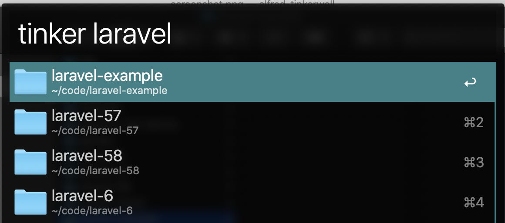

# Tinkerwell Workflow for Alfred

Open any local Laravel project with [Tinkerwell](https://tinkerwell.app) with this [Alfred](https://www.alfredapp.com) workflow.



## Installation

1. [Download the latest version](https://github.com/chrisrenga/alfred-tinkerwell/releases/latest)
2. Install the workflow by double-clicking the `.alfredworkflow` file

## Usage

Just type `tinker` followed by your search query.

```
tinker <query>
```

E.g.
```
tinker laravel6
```

press `<enter>` to open the Laravel project.

## Other Alfred workflows

- [TablePlus Workflow](https://github.com/chrisrenga/alfred-tableplus)
- [TailwindCss Docs Workflow](https://github.com/chrisrenga/alfred-tailwindcss-docs)

## Credits
Thanks to [huyphams](https://github.com/huyphams) for a great app and prompt reply to my questions.

Inspired by [tillkruss Alfred Laravel docs](https://github.com/tillkruss/alfred-laravel-docs)